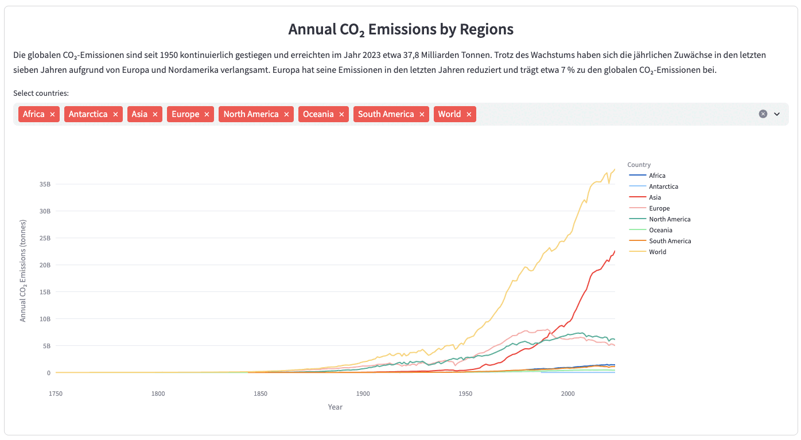

## **CO₂ Emissions Dashboard**  

**Data Source:** [Our World in Data](https://ourworldindata.org/)  
**Tools:** Python, Pandas (for data processing), Plotly (interactive charts), Logistic Regression (for emissions prediction), Streamlit (for dashboard deployment)  

#### **Project Description**  
The **CO₂ Emissions Dashboard** is an interactive tool for visualizing and forecasting global CO₂ emissions across different regions and sectors. Using historical data, it offers insights into emission trends, regional differences, and projected changes through **2100**.  

#### **Project Goals**  
- Build a **user-friendly dashboard** with **interactive charts and graphs** to explore both historical data and future predictions  
- **Identify top CO₂ contributors** and highlight regional trends  
- Analyze **CO₂ emissions by country**, with a focus on the **aviation sector**  
- Compare **aviation-related emissions** between countries  
- Forecast **future CO₂ emissions** using **Logistic Regression**

## **Dashboard Preview**  
[**Click on the link to explore more on the Streamlit WebApp.**](https://co2emissiondashboards.streamlit.app/)

